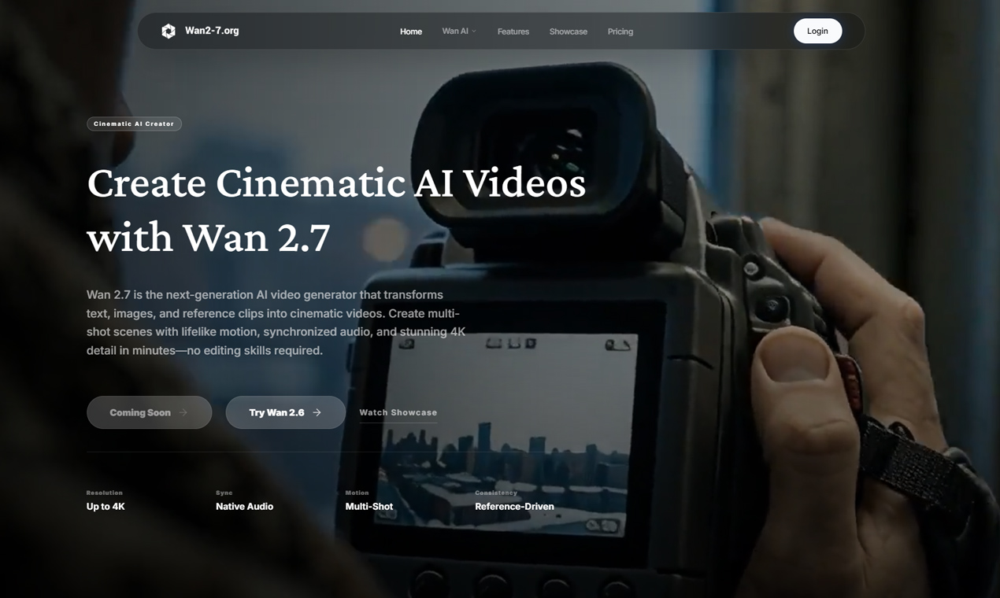

# Wan 2.7 AI Video Generator




## Overview

[Wan 2.7 AI Video Generator](https://www.wan2-7.org/) Wan 2.7 AI Video Generator focuses on faster cinematic video creation with a lighter workflow.

Wan 2.7 AI Video Generator is built for faster iteration when creators, marketers, and product teams want to turn text, images, and early concepts into more presentable video results without a heavyweight workflow.

## Why This Format Works On GitHub

- Clear public landing page with persistent history
- - Easy to show product context, screenshots, and examples together
  - - Better for repeatable updates than a one-off short post
   
    - ## Example Workflow
   
    - ```bash
      idea -> storyboard -> prompt -> multi-shot render -> review -> publish
      ```

      ## Prompt Example

      ```text
      Create a cinematic product teaser with two scene transitions, soft camera motion, realistic lighting, and synced ambient audio.
      ```

      ## Product Link

      Explore the official [Wan 2.7 AI Video Generator product page](https://www.wan2-7.org/) for the full workflow, latest examples, and current capabilities.
      
